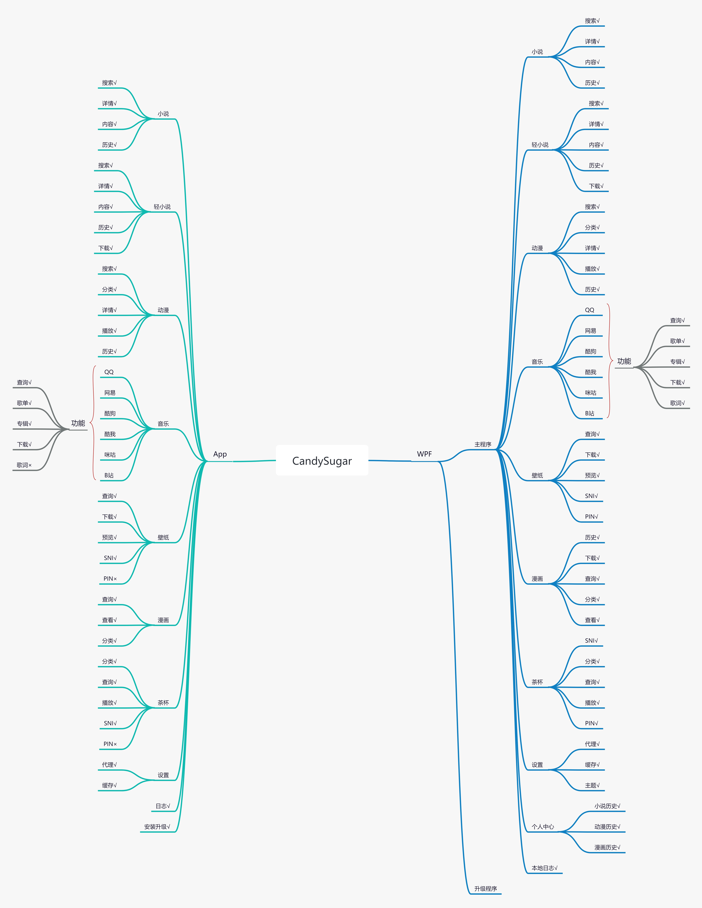
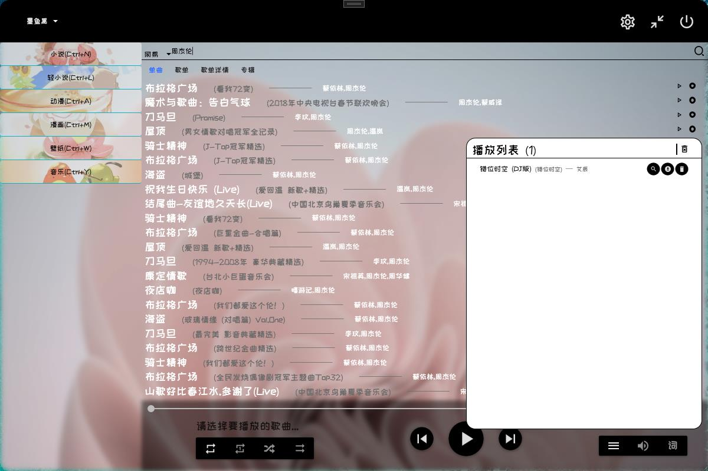
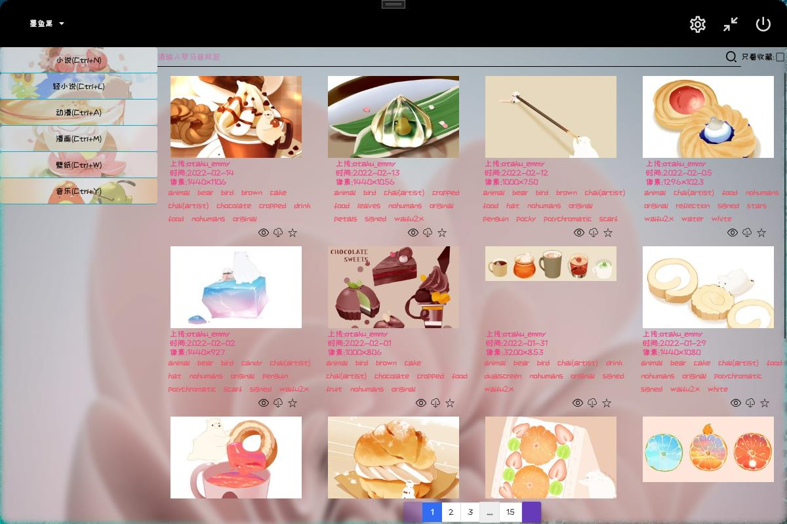
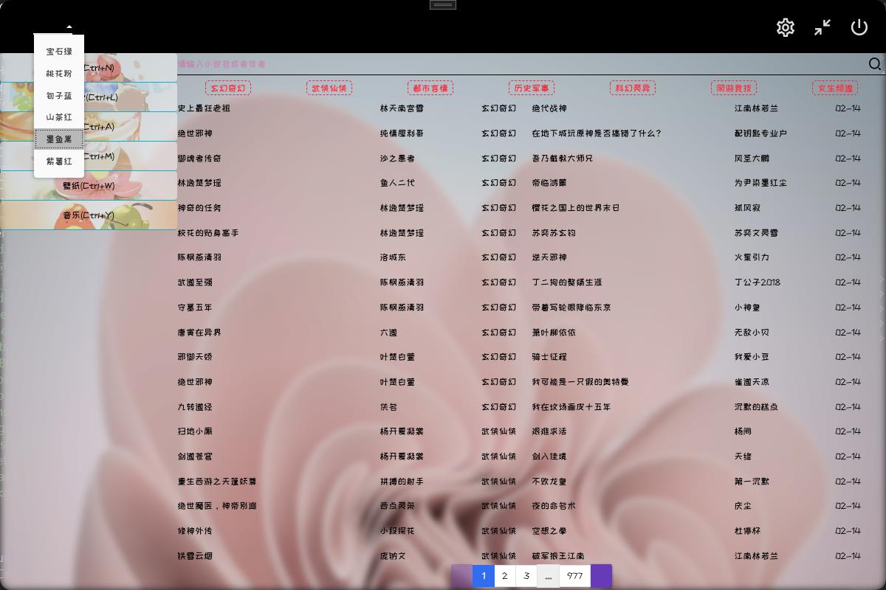
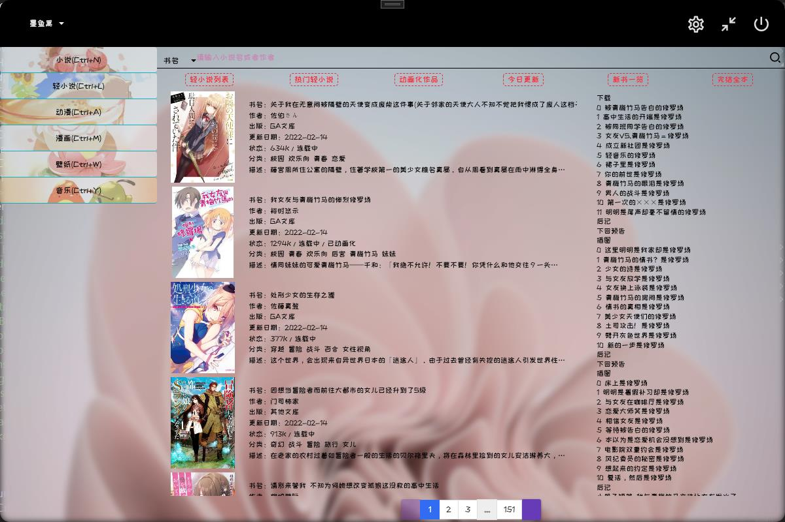
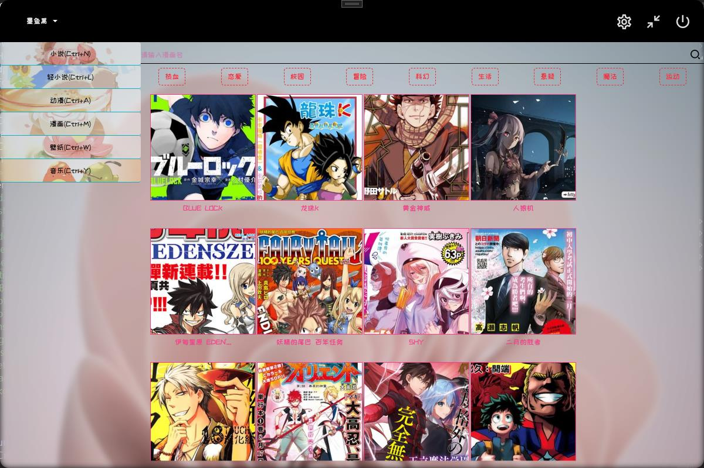
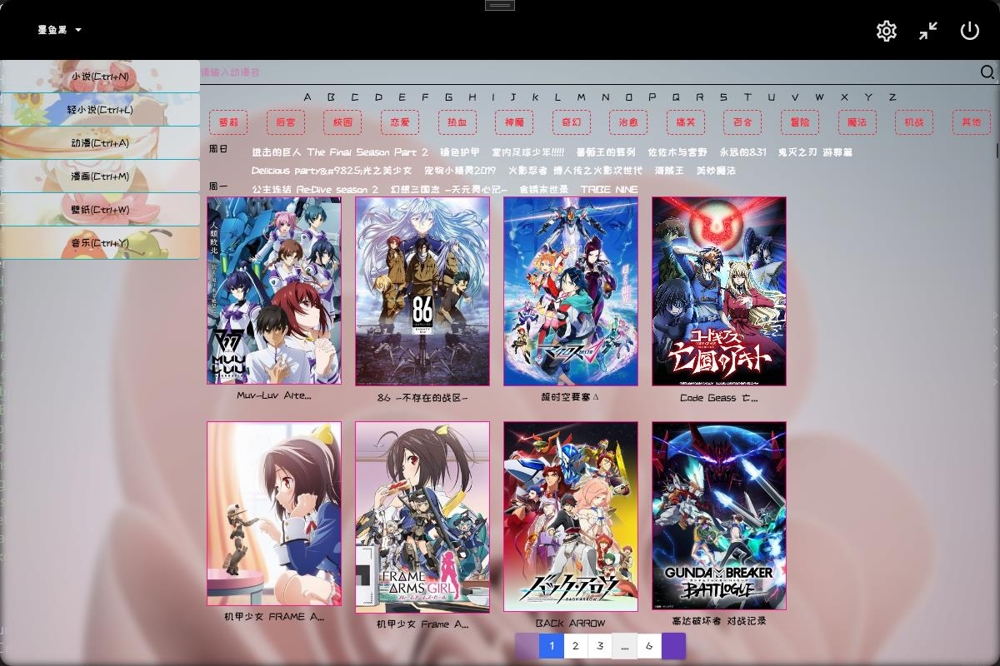
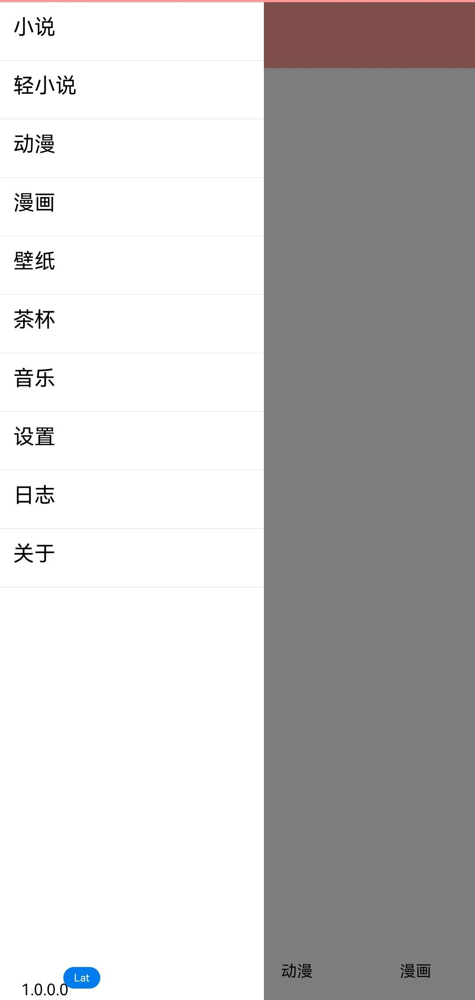
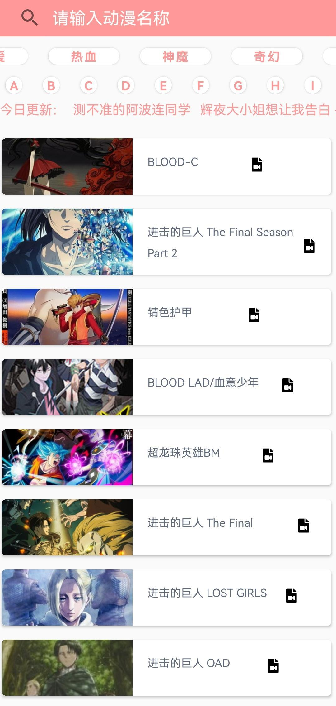

# 项目名称：甜糖（原：轻风神器）

### 项目简介：

一款基于C#.NET 6开发的WPF和Xamarin.Forms程序，支持在线看小说，轻小说，上K站，看动漫，看漫画，全网听歌等等。

有好的建议和BUG请提交在[此处](https://github.com/EmilyEdna/CandySugar/issues)

### 功能介绍：

1.支持小说的搜索，阅读。

2.轻小说内部集成开发者的账号和密码，使用者请自行在配置页面配置账号和密码，支持无版权小说下载阅读，可以看插图，支持作者和书籍名称搜索。

3.支持K站访问(已支持SNI)，支持搜索、收藏、下载、预览大图。

4.支持全网动漫观看，包括深夜档，采用VLC或者DPlayer播放。

5.支持QQ、网易、咪咕、酷狗、酷我、B站的音乐播放，支持歌单、专辑、歌词等。

6.支持汉化漫画的在线观看和下载。

7.程序提供丰富的个性化功能，支持背景替换，主题颜色等。

8.提供个人中心服务等。

9.提供实验性功能~~~

### 注意事项：

看漫画时因为图片过大可能会导致内存溢出，具体请看任务管理器软件的内存使用情况，GC回收内存也会等待一会儿，GC回收完成后软件内存占用大约在20M-80M之间。

### 用户协议：

1.您不得对本产品进行任何形式的许可、出售、租赁、转让、发行或其他商业用途。

2.除非法律禁止此类限制，否则您不得对本产品的任何部分或衍生产品进行修改、翻译、改编、合并、利用、分解、改造或反向编译、反向工程等。

3.您不得删除或破坏包含在本产品中的任何版权声明或其他所有权标记。

4.本软件任何版本所有权归EmilyEdna所有，且禁止任何人任何组织使用本软件进行非法盈利，本软件仅是为了学习，使用者在使用过程中产生任何法律纠纷均与作者无关。

### 打赏作者：

### 下载链接：
[甜糖](https://github.com/EmilyEdna/CandySugar/releases/download/V1/CandySugar.7z)

### 软件截图：

### 软件引用：
##### WPF
[MaterialDesignThemes](https://github.com/MaterialDesignInXAML/MaterialDesignInXamlToolkit)

[HandyControl](https://github.com/ghost1372/HandyControls)

##### Xamarin.Froms
[FFImageLoading](https://github.com/luberda-molinet/FFImageLoading)

[XF.Material](https://github.com/Baseflow/XF-Material-Library)
